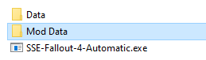
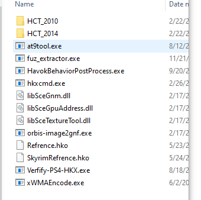

# SSE-Fallout-4-Automatic
Fully integrated all my Skyrim/Fallout tools into a simple CLI based program

**NOTES:**
---------------------------------------------------------------------
Note: for animations it will dectect the hkx version(s)(32-Bit/64-Bit) and(2010/2014) and convert them based appon that info.

Note: it requires all the required tools to be in the data folder.

Note: If you get stuck on "Converting Animations" double check havok content tools is installed and copied it to the data folder.

Note: The Data Folder Set-up is identical to my other tools execpt everything is in one folder... how it should look: 

**INFO/Usage:**
---------------------------------------------------------------------
Download the tool from the [releases](https://github.com/Backporter/SSE-Fallout-4-Automatic/releases) page, go to my [animation tool](https://github.com/Backporter/SSE-Fallout-4-Animation-Converter/releases/tag/1.5.1) page download it, extract the *.hko's into the data folder, create an folder called "Mod Data" and extract the mods assets to that folder, run the app, you should see a console menu apear, it should say, "converting X" than "Converted x!" when its done, that is how you know its working, if nothing apears double check you have everything set-up and re-run the app.

**SKYRIM:**
---------------------------------------------------------------------
32-Bit animations for skyrim will be converted using Havok Behavior Post Process

64-Bit animations for skyrim will be backported using the havok content tools

**FALLOUT 4**
---------------------------------------------------------------------
64-Bit animations for Fallout 4 will be packported using the havok content tools.
